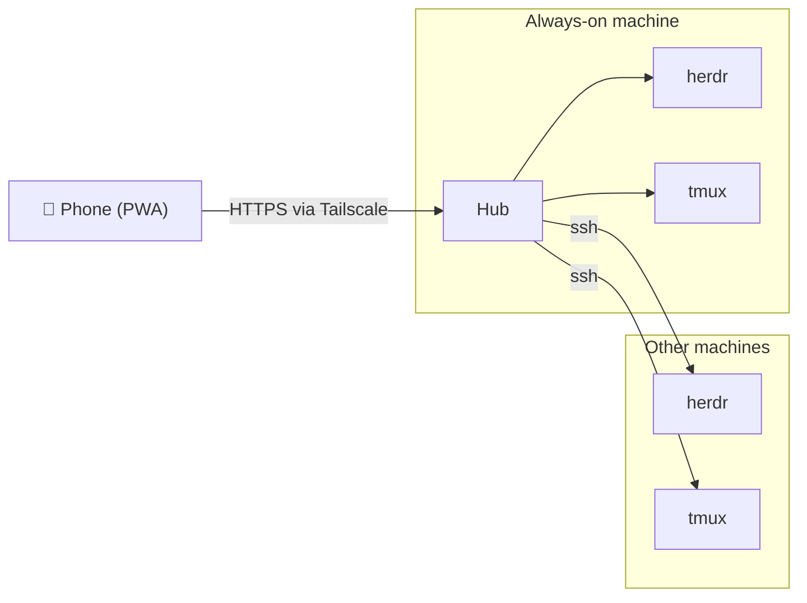

# taut

See every coding agent running in your terminal multiplexers, from your phone. Reply,
approve, attach a photo, dictate a prompt. Works over Tailscale as an installable PWA.

> Status: pre-alpha, phase 1 of 8. See [docs/ROADMAP.md](docs/ROADMAP.md).

## What it does

- Lists every Pane across your machines, with the agent's Status: working, blocked, done, idle.
- Opens a Pane as a rendered screen with a key bar and a composer, no terminal emulator.
- Turns herdr's own prompt detection into tap-to-answer buttons when an agent is blocked.
- Pushes a notification when an agent needs you.

Backends: [herdr](https://herdr.dev) in full, tmux for list, read and input.

## How it works

One **Hub** runs on the machine that is always on. It talks to herdr over its unix socket
and reaches other machines over SSH. Your phone talks only to the Hub, through
`tailscale serve`, so there is no login screen and nothing is exposed to the internet.



Read [docs/ARCHITECTURE.md](docs/ARCHITECTURE.md) for the design and
[CONTEXT.md](CONTEXT.md) for the vocabulary.

## Development

Requires [Bun](https://bun.sh) 1.2+, pnpm, and a running herdr.

```sh
pnpm install
pnpm dev            # Hub on 127.0.0.1:7700, Vite on 127.0.0.1:5173
tailscale serve --bg 5173   # then open https://<hub>.<tailnet>.ts.net on the phone
```

```sh
pnpm test           # bun test
pnpm typecheck
pnpm build          # web app to dist/web
```

## License

MIT
