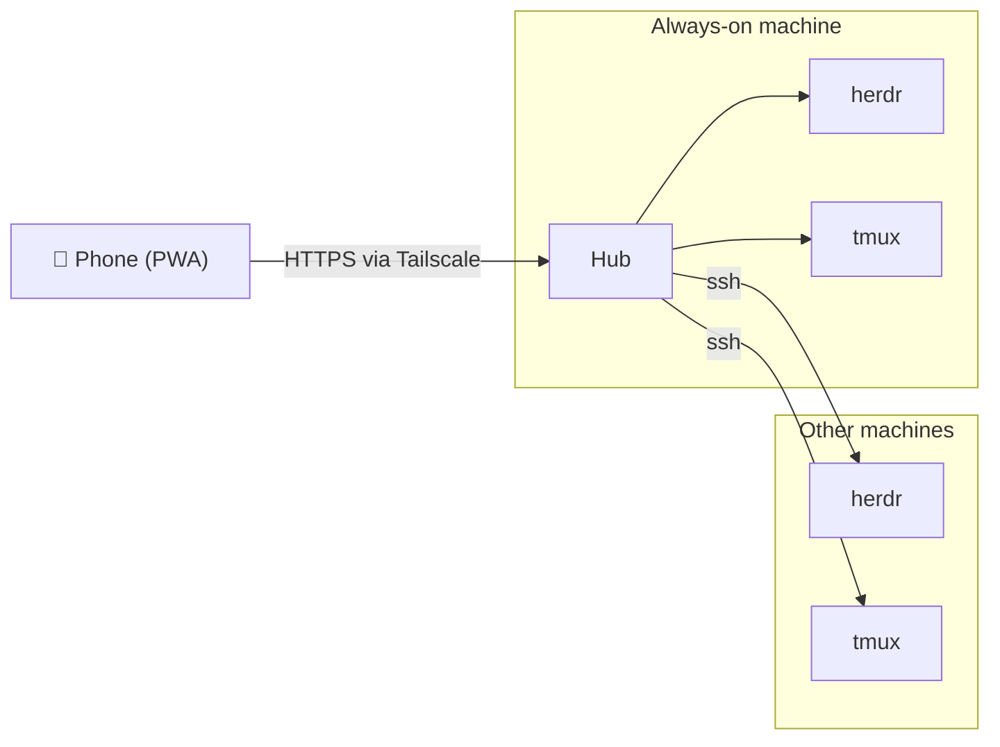

# tautan

See every coding agent running in your terminal multiplexers, from your phone. Reply,
approve, attach a photo, dictate a prompt. Works over Tailscale as an installable PWA.

## What it does

- Lists every Pane across your machines, with the agent's Status: working, blocked, done, idle.
- Opens a Pane as a rendered screen with a key bar and a composer, no terminal emulator.
- Turns herdr's own prompt detection into tap-to-answer buttons when an agent is blocked.
- Offers quick replies per agent, and three drafted from the last screen when you enable
  Smart replies.
- Pushes a notification when an agent enters `blocked`, and badges the app for unseen work.
- Creates a Tab or a Workspace, starts an agent in it, renames and closes Panes.
- Shows `git diff` for a Workspace: working tree, staged, or against the base branch.
- Reaches remote machines over SSH, so one Hub covers your whole tailnet.

Backends: [herdr](https://herdr.dev) in full, tmux for list, read and input.

## Screenshots

| Home | Pane | Hosts |
|---|---|---|
|  |  |  |

The full screen set lives in [docs/design/](docs/design/) and on the
[design canvas](https://claude.ai/code/artifact/ee67305a-ece1-4d62-b0b7-e866752a7030).

## How it works

One **Hub** runs on the machine that is always on. It talks to herdr over its unix socket
and reaches other machines over SSH. Your phone talks only to the Hub, through
`tailscale serve`, so nothing is exposed to the internet.



Read [docs/ARCHITECTURE.md](docs/ARCHITECTURE.md) for the design,
[docs/SECURITY.md](docs/SECURITY.md) before exposing a Hub, [docs/DECISIONS.md](docs/DECISIONS.md)
for why it is built this way and why it is not a collie fork, and [CONTEXT.md](CONTEXT.md)
for the vocabulary.

## Install

Pick one path. Run the Hub on the machine that already has SSH access to the others.

### bunx

Requires [Bun](https://bun.sh) 1.2+ and a running herdr on the same machine.

```sh
bunx tautan
```

The Hub prints `http://127.0.0.1:7700` and the Muxes it found. To keep it running after you
log out, add a systemd user unit at `~/.config/systemd/user/tautan.service`:

```ini
[Unit]
Description=tautan Hub

[Service]
ExecStart=%h/.bun/bin/bunx tautan
Environment=TAUTAN_PORT=7700
# Optional: draft three replies per blocked Pane with a small model.
# Environment=TAUTAN_SUGGEST=zai
# Environment=TAUTAN_SUGGEST_KEY=...
Restart=on-failure

[Install]
WantedBy=default.target
```

Then enable it, and let it start before you log in:

```sh
systemctl --user enable --now tautan
loginctl enable-linger $USER
```

### Docker

The image is `ghcr.io/radityasurya/tautan:latest`. It needs the herdr socket and your SSH
configuration, both read-only:

```yaml
services:
  tautan:
    image: ghcr.io/radityasurya/tautan:latest
    network_mode: host
    # Must be the uid that owns the herdr socket. herdr has no auth of its own;
    # the socket's file permissions are the boundary.
    user: "1000:1000"
    environment:
      TAUTAN_BIND: 127.0.0.1
      HERDR_SOCKET_PATH: /herdr/herdr.sock
    volumes:
      - ~/.config/herdr:/herdr:ro
      - ~/.ssh:/home/tautan/.ssh:ro
      - tautan-data:/data
    restart: unless-stopped

volumes:
  tautan-data:
```

`network_mode: host` with `TAUTAN_BIND=127.0.0.1` keeps the Hub on the host's loopback, where
`tailscale serve` can reach it and nothing else can.

The image itself defaults to `TAUTAN_BIND=0.0.0.0`, because a bridged container has to bind
its own interface. Override it, as above, whenever the container shares the host's network.

On Unraid, use a Community Applications template:

| Field | Value |
|---|---|
| Repository | `ghcr.io/radityasurya/tautan:latest` |
| Network Type | Host |
| Path | `/mnt/user/appdata/tautan` → `/data` |
| Path (read only) | the herdr user's config directory, for example `/root/.config/herdr` → `/herdr` |
| Path (read only) | that user's `.ssh` directory → `/home/tautan/.ssh` |
| Variable | `TAUTAN_BIND` = `127.0.0.1` |
| Variable | `HERDR_SOCKET_PATH` = `/herdr/herdr.sock` |

The container runs as uid 1000. If the herdr socket belongs to another user, set the
container's uid to that user, or the Hub cannot open the socket.

### From source

```sh
git clone https://github.com/radityasurya/tautan
cd tautan
pnpm install
make dev
```

`make dev` frees the ports, starts the Hub and Vite, maps `tailscale serve`, and prints a
local URL and a tailnet URL.

## Expose

The Hub binds to loopback. `tailscale serve` is how the phone reaches it:

```sh
tailscale serve --bg 7700
```

Then, on the phone:

1. Open the tailnet URL in Safari, for example `https://hub.tail1234.ts.net/`.
2. Share → **Add to Home Screen**. iOS only delivers push to an installed PWA.
3. Open the installed app, go to **Settings**, and turn on **Push when an agent is blocked**.

Never expose port 7700 any other way.

## Configure

### Environment

| Variable | Default | What |
|---|---|---|
| `TAUTAN_PORT` | `7700` | the port the Hub listens on |
| `TAUTAN_BIND` | `127.0.0.1` | the interface it binds; leave it on loopback |
| `TAUTAN_MAX_ATTACHMENT_MB` | `200` | the cap on one upload |
| `TAUTAN_SUGGEST` | `off` | Smart replies provider: `off`, `zai` or `anthropic` |
| `TAUTAN_SUGGEST_KEY` | — | the provider key. Without it, `zai` reads `ZAI_API_KEY` then `~/.config/zai/api-key`, and `anthropic` reads `ANTHROPIC_API_KEY` |
| `TAUTAN_SUGGEST_MODEL` | `glm-5.2` for `zai`, `claude-haiku-4-5-20251001` for `anthropic` | the model that drafts the replies |
| `HERDR_SOCKET_PATH` | — | one herdr socket to use instead of discovery. Set it, and the Hub skips `herdr session list` and `~/.config/herdr/herdr.sock` |

[docs/ARCHITECTURE.md](docs/ARCHITECTURE.md#environment) lists `TAUTAN_SUGGEST_BASE` too, for
a proxy or a self-hosted gateway.

### Hosts

Remote machines live in `$XDG_CONFIG_HOME/tautan/hosts.json` (`~/.config/tautan/hosts.json`),
an array of entries:

```json
[
  {
    "id": "vps",
    "label": "VPS",
    "target": "dev@vps.tail1234.ts.net",
    "session": "default"
  }
]
```

`id` and `target` are required; `target` is an SSH target the Hub user can reach without a
password. Omit `session` to use every running herdr session on that Host. Add `"tmux": true`
to poll its tmux servers as well.

You do not have to edit the file. The **Hosts** tab writes it: add a Host, press **Probe** to
dial the target once, then **Save**. Hosts that come from `herdr machine list` appear there
too, read-only.

### Trusted login

Anyone on your tailnet who can reach the Hub can read every screen and type into every agent.
To limit that, lock the Hub to one Tailscale identity: open **Settings → Access** and press
**Lock to this login**. The Hub stores the `Tailscale-User-Login` value that request carried,
and then rejects every request that does not match it with 403. Press **Unlock** to clear it.

A Hub can only lock itself to the login the locking request already carries, so one phone
cannot lock a Hub to somebody else's identity. There is no password and no login screen;
Tailscale is the only authentication.

## Security

- Tailscale is the only way in. The Hub binds to loopback and expects `tailscale serve` in
  front. It is never reachable from the internet.
- Every non-GET request must carry an `Origin` that matches the `Host` header.
- tautan stores no passwords, SSH keys, or tokens. It uses the Hub user's own SSH
  configuration, with `BatchMode=yes`, so it never opens a password prompt.
- `state.json` holds the VAPID private key and your push endpoints. Treat it as a credential;
  delete it to revoke every subscription.
- A push notification carries the agent name, the Workspace label, and one line of the Pane's
  output. It is encrypted end to end, but the phone shows it in the notification tray.
- Smart replies are off by default. When you turn them on, the last 40 lines of a blocked
  Pane's screen go to a third-party model provider.

Read [docs/SECURITY.md](docs/SECURITY.md) for the trust boundaries and the hardening
checklist before you expose a Hub.

## Status

Version 0.1.1, released 2026-09-12 on [npm](https://www.npmjs.com/package/tautan),
[GHCR](https://github.com/radityasurya/tautan/pkgs/container/tautan) and
[GitHub releases](https://github.com/radityasurya/tautan/releases). Every phase of
[docs/ROADMAP.md](docs/ROADMAP.md) is built: every screen, a local herdr, triage, push,
attachments, quick replies, remote Hosts over SSH, tmux, write operations, diff review, and
packaging. See [CHANGELOG.md](CHANGELOG.md).

Confirmed on a real iPhone: the installed PWA, the Agents and Pane screens, and a push
notification on a blocked agent. Items marked `[~]` in the roadmap are built and driven in an
emulated phone but not yet confirmed on a device: the Explain card, Seen, tab swipes,
dictation and read-aloud, a photo attachment, smart replies, and the SSH forwarder reconnect.

Two known limits: tmux reports Status `unknown` for every Pane, and a Pane cannot be resized
to the phone's width, because herdr 0.9 shares one width between all clients.

## Development

Requires [Bun](https://bun.sh) 1.2+, pnpm, and a running herdr.

```sh
make dev     # frees the ports, starts Hub + Vite, maps tailscale serve, prints the URLs
make stop    # kills leftovers and removes the tailscale serve mapping
make test    # bun test: unit and contract tests
make check   # typecheck + build
make help    # everything else
```

`make dev` prints a local URL and a tailnet URL; open the tailnet one on the phone.

**Never send input to a multiplexer you did not start.** Tests start their own herdr or tmux
on a throwaway socket through `test/harness.ts`, which gives the server its own `HOME` and
XDG directories and removes them afterwards. The developer's live herdr
(`~/.config/herdr/herdr.sock`) is read-only.

[CONTRIBUTING.md](CONTRIBUTING.md) has the rest: the checks, the pull request rules, and how
to cut a release.

## License

MIT
