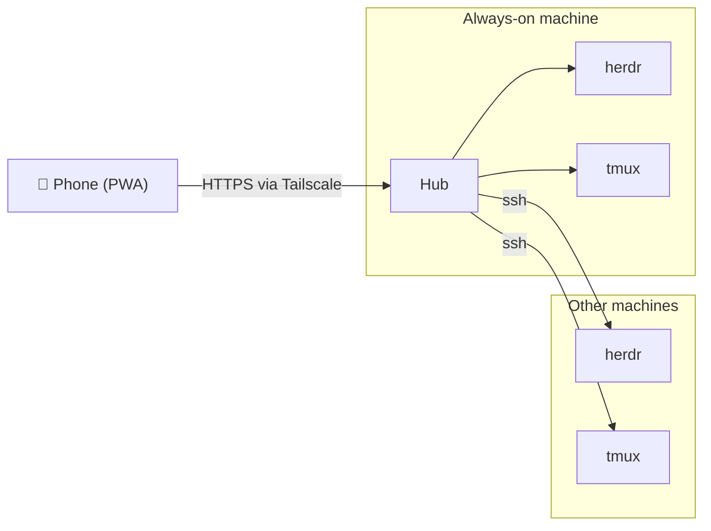

# tautan

See every coding agent running in your terminal multiplexers, from your phone. Reply,
approve, attach a photo, dictate a prompt. Works over Tailscale as an installable PWA.

> Status: pre-alpha. Phase 1 (wire a local herdr) is in progress; phase 0 (all screens on mock data) follows. See [docs/ROADMAP.md](docs/ROADMAP.md).

## What it does

- Lists every Pane across your machines, with the agent's Status: working, blocked, done, idle.
- Opens a Pane as a rendered screen with a key bar and a composer, no terminal emulator.
- Turns herdr's own prompt detection into tap-to-answer buttons when an agent is blocked.
- Pushes a notification when an agent needs you.

Backends: [herdr](https://herdr.dev) in full, tmux for list, read and input.

## How it works

One **Hub** runs on the machine that is always on. It talks to herdr over its unix socket
and reaches other machines over SSH. Your phone talks only to the Hub, through
`tailscale serve`, so there is no login screen and nothing is exposed to the internet.



Read [docs/ARCHITECTURE.md](docs/ARCHITECTURE.md) for the design,
[docs/SECURITY.md](docs/SECURITY.md) before exposing a Hub, [docs/DECISIONS.md](docs/DECISIONS.md)
for why it is built this way and why it is not a collie fork, and [CONTEXT.md](CONTEXT.md)
for the vocabulary.

## Development

Requires [Bun](https://bun.sh) 1.2+, pnpm, and a running herdr.

```sh
make dev     # frees the ports, starts Hub + Vite, maps tailscale serve, prints the URLs
make stop    # kills leftovers and removes the tailscale serve mapping
make help    # everything else: install, test, check, build
```

`make dev` prints a local URL and a tailnet URL; open the tailnet one on the phone.

## License

MIT
