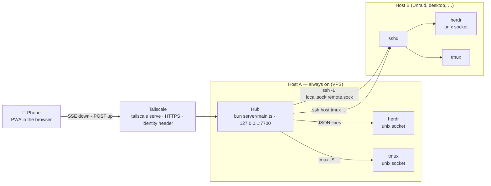
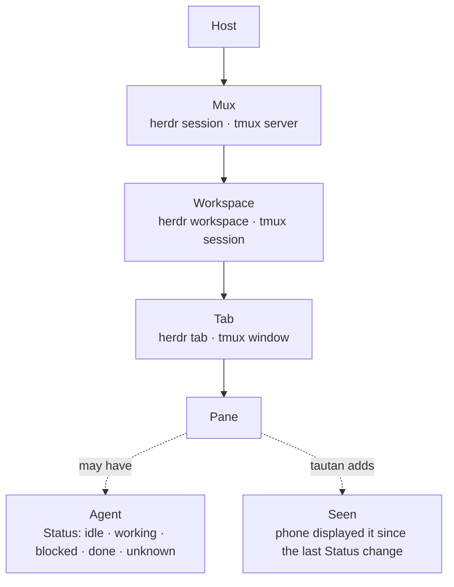
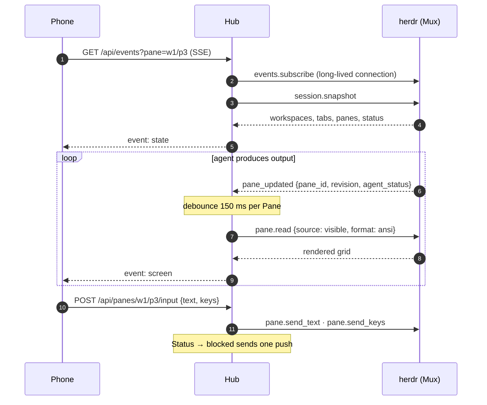
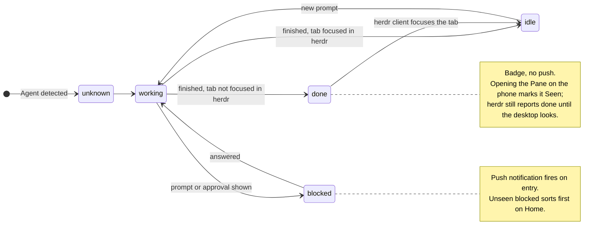
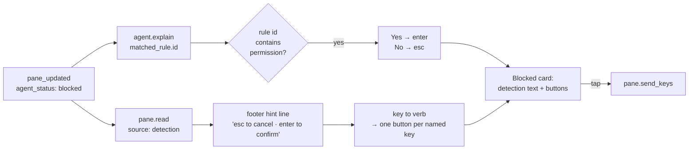

# Architecture

tautan is a **Hub** (a Bun process) plus a **PWA**. The Hub talks to multiplexers; the PWA
talks only to the Hub. Vocabulary is in [../CONTEXT.md](../CONTEXT.md).

One **Hub** per always-on Host. Remote Hosts need only `sshd` and the multiplexer; the Hub
uses the Hub user's own SSH configuration. The phone has one origin, one service worker,
one push subscription.

**Remote Hosts change nothing above the socket.** For each remote herdr Mux the Hub runs one
`ssh -L <local>.sock:<remote>.sock` forwarder and points `HerdrMux` at the forwarded local
socket; the adapter dials a unix socket either way and does not know which Host it reached.
Remote tmux is the same idea over a ControlMaster connection, so `tmux -S` runs on the other
side with one TCP handshake, not one per command. Everything above — the Mux registry, the
state projection, Seen, SSE, push — is unchanged.

### What the phone sees

Home flattens this to one list of Panes grouped by Workspace, unseen `blocked` first.

### How a screen stays live

## Facts the design depends on

- herdr has no network surface. Its only IPC is newline-delimited JSON over a unix socket
  (`~/.config/herdr/herdr.sock`; other sessions via `herdr session list --json`). The
  server closes the connection after **one** response, so the client opens a connection per
  request. Only `events.subscribe` stays open.
- `pane.updated` events carry the full pane record (`revision`, `agent_status`) on every
  output change, roughly ten per second per working pane. There is no replay: subscribe,
  then take a `session.snapshot`.
- `pane.read` returns the rendered grid (`format: ansi`) or text; sources `visible`,
  `recent`, `recent_unwrapped`, `detection`. No cursor position.
- `agent.explain` returns the matched detection rule (`matched_rule.id`) and evidence;
  `pane.read` with `source: detection` returns the region herdr classified, footer hints
  included. tautan builds tap-to-answer buttons from these; it has no per-agent grammars.
- tmux: `list-panes -a -F`, `capture-pane -e -p`, `send-keys -l`. No events; tautan polls.

### Status and Seen

Status comes from the Mux. Seen is tautan's own layer on top; it decides sort order and badges.

### Blocked → tap-to-answer

tautan writes no prompt grammars. herdr classifies the screen; tautan turns that into buttons.

Digits become buttons only when the footer names them; a numbered list is answered with the
arrow keys and Enter, which every prompt announces.

## Backend interface

One interface, two implementations (`shared/types.ts`, `Mux`). herdr implements everything;
tmux implements list, read, send and throws `unsupported` for the rest. There are no
capability flags: the UI hides write actions when `kind === 'tmux'`.

## Hub (`server/mux.ts`)

- Registry of Muxes keyed `<hostId>/<muxId>`; Panes keyed `<hostId>/<muxId>/<paneId>`.
- Any change from an adapter → 200 ms debounce → `tree()` → Status diff → SSE `state`
  (throttled to 2/s).
- Every Mux also refreshes its snapshot every 15 s (`new Hub({refreshMs})`, `0` disables
  it). It is a safety net: herdr sends no event when a pane stops producing output, so a
  Status that settles into `blocked` between events would otherwise arrive late.
- A Status **transition** into `blocked` sends one push per subscription. A Pane that is
  already `blocked` sends nothing, and `done` never pushes — it is a badge.
- Each SSE client may watch one Pane: changes on it → 150 ms debounce → `read()` → SSE `screen`.
- **Seen** is `{paneKey: revision}` persisted in `state.json`; unseen = `revision > seen`.
- `StatePane.command` is the Pane's foreground command name, which picks the App profile on
  the phone: tmux reads `pane_current_command`, herdr answers `pane.process_info` through
  `HerdrMux.foregroundCommand`. It is read with the last line, once per revision, and cached
  with it, because `foreground_processes` is a per-Pane call.
- The Hub never calls any `*.focus` method.

## HTTP API (`server/http.ts`)

| Route | Purpose |
|---|---|
| `GET /api/state` | hosts, muxes, workspaces, panes (with status, revision, seenRevision, preview) |
| `GET /api/events?pane=<key>` | SSE: `state`, `screen`; comment ping every 25 s |
| `GET /api/panes/:key/screen?mode=visible\|recent` | one Screen |
| `POST /api/panes/:key/input` `{text?, keys?, raw?}` | text first, then keys, then `raw` — bytes written to the pty untouched |
| `POST /api/panes/:key/mouse` `{kind, col, row, allow}` | `kind` is `click\|right\|double\|wheelUp\|wheelDown`, `col`/`row` are 1-based cells; the Hub builds the SGR press and release (`mouseBytes`) and sends them as `raw` → 204. 400 `{error: 'body'}` on an unknown kind or a coordinate outside 1…9999, 409 `{error: 'mouse-off'}` unless `allow` is true |
| `POST /api/panes/:key/seen` `{revision}` | mark Seen |
| `GET /api/panes/:key/explain` | Explain or null |
| `POST /api/panes/:key/attach` (raw body, `X-Name: <filename>`) | write the file on the Pane's Host → `{path, bytes, display}`; 413 over `TAUTAN_MAX_ATTACHMENT_MB` |
| `GET /api/workspaces/:key/diff?scope=working\|staged\|base[&file=<path>]` | run `git diff --no-color -U3` in the Workspace cwd, local or over SSH, and parse it with `shared/diff.ts` → `DiffResult`. `base` resolves `review.base` → upstream → `origin/HEAD` → main/master. Over 64 KB the file list is cut and `truncated` is true; `file=` returns that one file uncapped. 400 `{error: 'scope'}`, 404 `{error: 'unknown-workspace'}`, 409 `{error: 'not-a-repo'}`, 502 `{error: <git error>}` |
| `POST /api/muxes/:key/tabs` `{workspaceId, cwd?, label?, agent?}` | new Tab with one Pane, agent started when asked → 201 `{paneKey}` |
| `POST /api/muxes/:key/workspaces` `{cwd?, label?, branch?}` | new Workspace; `branch` makes it a git worktree → 201 `{workspaceKey}` |
| `POST /api/rename` `{muxKey, label, workspaceId\|tabId\|paneId}` | rename one of the three → 204 |
| `POST /api/panes/:key/close` | close the Pane → 204 |
| `GET /api/push/vapid` | the Hub's VAPID public key, base64url |
| `POST /api/push/subscribe` (a `PushSubscription` as JSON) | store the subscription |
| `DELETE /api/push/subscribe` `{endpoint}` | forget it |
| `POST /api/hosts/probe` `{target, session?}` | dial a target once and save nothing → `{online, sessions?, error?}`; 400 `{error: 'target'}` for a target that is not `user@host` |
| `POST /api/hosts/:id/retry` | re-dial one Host, local or remote → the updated `StateHost`; the SSE `state` event is the receipt |
| `GET /api/settings` | trusted user, the login this request carries, what serves the app, `hosts.json`, and the Smart replies provider, model and flag |
| `PUT /api/settings` `{trustedUser?, hosts?}` | replace either; an omitted key is left alone, `trustedUser: null` unlocks → the new `Settings` |
| `POST /api/settings/suggest` `{enabled}` | turn Smart replies on or off on the Hub; the Hub persists the flag |
| `POST /api/panes/:key/suggest` | draft Smart replies for this Pane now → the StatePane; needs `TAUTAN_SUGGEST`; no-op while the Hub flag is off or a request for that revision is already in flight |

The four write routes answer `{error}` with 400 (empty or over-80-character label, `cwd`
not absolute), 403 (Origin), 404 (unknown Mux, Workspace or Pane), 501 `unsupported`
(tmux cannot create, rename or close) and 502 with herdr's own error code, for example
`agent_not_ready`. The Hub refreshes State after a write, so the SSE `state` event is the
receipt.

The Hub encrypts each payload itself (RFC 8291, aes128gcm) and signs the request (RFC
8292, VAPID) with WebCrypto in `server/push.ts`; there is no `web-push` dependency. A push
service that answers 404 or 410 has its subscription dropped from `state.json`.

Auth: the Hub binds to loopback and expects `tailscale serve` in front. Every non-GET
request must carry an `Origin` whose host equals the `Host` header. If a trusted login is
configured, the `Tailscale-User-Login` header must match, or the request is 403
`{error: 'login'}`. `PUT /api/settings` may only lock the Hub to the login that request
itself carries; any other value is 400 `{error: 'login'}`, so one phone cannot lock a Hub to
somebody else's identity.

## Web app (`web/`)

Hash router, one `EventSource`, no state library. Screens: **Home** (flat Pane list grouped
by Workspace, unseen `blocked` first), **Pane** (grid of spans from `shared/ansi.ts`, recent
mode, key bar, composer with mic and attach), **Settings**. `web/push.ts` owns the
subscription and the app badge; `web/public/sw.js` shows the notification, routes the tap
and caches the shell, and `vite.config.ts` stamps the built file list into it. Themes are
`data-theme` values on `<html>`; each defines chrome tokens and sixteen ANSI colors as CSS
variables.

## Files on the Hub

| Path | Content |
|---|---|
| `$XDG_CONFIG_HOME/tautan/hosts.json` | an array of `HostConfig` (`{id, label?, target, session?, herdr?, tmux?}`), written whole by `PUT /api/settings {hosts}` from the Hosts screen |
| `$XDG_STATE_HOME/tautan/state.json` | `seen`, `vapid: {publicKey, privateKey}`, `subscriptions: [...]`, `trustedUser` |
| `$XDG_CACHE_HOME/tautan/` | `attachments/<unix-ms>-<name>` |
| `$XDG_RUNTIME_DIR/tautan/` | one forwarded socket per remote Mux, `<hostId>-<session>.sock`, beside its `cm-*` ControlMaster socket. With no `XDG_RUNTIME_DIR` the directory is `/tmp/tautan-<uid>`; either way it is mode 0700, because a unix socket a second user can open is a second user on the Mux |

### In the container

The image sets the four XDG variables to directories under one volume, so everything the Hub
writes lands in `/data`:

| Container path | XDG variable | Content |
|---|---|---|
| `/data/config/tautan/hosts.json` | `XDG_CONFIG_HOME=/data/config` | the `HostConfig` array |
| `/data/state/tautan/state.json` | `XDG_STATE_HOME=/data/state` | `seen`, the VAPID pair, `subscriptions`, `trustedUser` |
| `/data/cache/tautan/attachments/` | `XDG_CACHE_HOME=/data/cache` | uploaded files, never pruned |
| `/data/run/tautan/` | `XDG_RUNTIME_DIR=/data/run` | forwarded sockets and ControlMaster sockets |

Two paths come from the host instead, both read-only: the herdr configuration directory at
`/herdr` (`HERDR_SOCKET_PATH=/herdr/herdr.sock` points the Hub at the socket in it) and the
Hub user's SSH directory at `/home/tautan/.ssh`. The container runs as uid 1000, which must
be the uid that owns the herdr socket, because socket file permissions are the only boundary
there.

`/data/run` is a volume, not a tmpfs, so a forwarded socket can outlive a restart. The Hub
recreates the directory at mode 0700 and re-dials each Host on start, so a stale socket file
is replaced, not reused.

## Environment

| Variable | Default | What |
|---|---|---|
| `TAUTAN_PORT` | `7700` | the port the Hub listens on |
| `TAUTAN_BIND` | `127.0.0.1` | the interface it binds; leave it on loopback |
| `TAUTAN_MAX_ATTACHMENT_MB` | `200` | the cap on one upload |
| `TAUTAN_SUGGEST` | `off` | Smart replies provider: `off`, `zai` or `anthropic` |
| `TAUTAN_SUGGEST_KEY` | — | the provider key. Without it, `zai` reads `ZAI_API_KEY` then `~/.config/zai/api-key`, and `anthropic` reads `ANTHROPIC_API_KEY` |
| `TAUTAN_SUGGEST_MODEL` | `glm-5.2` for `zai`, `claude-haiku-4-5-20251001` for `anthropic` | the model that drafts the replies |
| `TAUTAN_SUGGEST_BASE` | `https://api.z.ai/api/anthropic`, `https://api.anthropic.com` | the API base, for a proxy or a self-hosted gateway |

## Smart replies

With `TAUTAN_SUGGEST` set, the Hub asks a small model for up to three one-line
replies whenever an agent Pane enters `blocked` or `done`, and puts them on
`StatePane.suggestions`. One call per Status change, cached by revision, from the
last 40 non-empty lines of the Screen. `POST /api/settings/suggest` is the
runtime switch and `POST /api/panes/:key/suggest` forces a fresh draft. The phone
has its own switch and shows the drafts only when both are on; what leaves the Hub
is in [SECURITY.md](./SECURITY.md).
