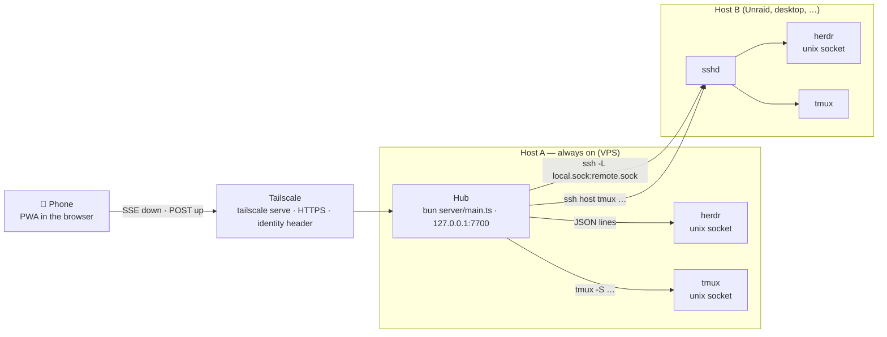
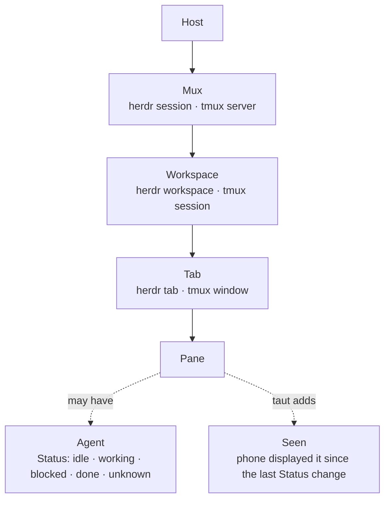
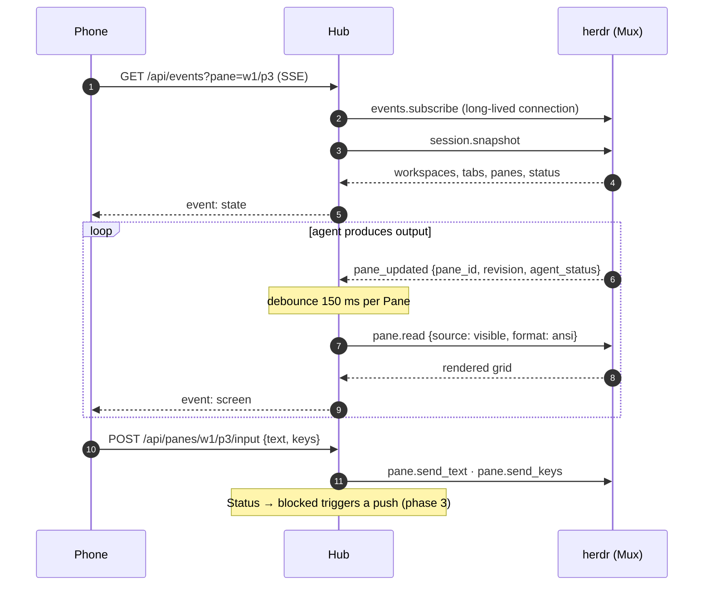

# Architecture

taut is a **Hub** (a Bun process) plus a **PWA**. The Hub talks to multiplexers; the PWA
talks only to the Hub. Vocabulary is in [../CONTEXT.md](../CONTEXT.md).

One **Hub** per always-on Host. Remote Hosts need only `sshd` and the multiplexer; the Hub
uses the Hub user's own SSH configuration. The phone has one origin, one service worker,
one push subscription.

### What the phone sees

Home flattens this to one list of Panes grouped by Workspace, unseen `blocked` first.

### How a screen stays live

## Facts the design depends on

- herdr has no network surface. Its only IPC is newline-delimited JSON over a unix socket
  (`~/.config/herdr/herdr.sock`; other sessions via `herdr session list --json`). The
  server closes the connection after **one** response, so the client opens a connection per
  request. Only `events.subscribe` stays open.
- `pane.updated` events carry the full pane record (`revision`, `agent_status`) on every
  output change, roughly ten per second per working pane. There is no replay: subscribe,
  then take a `session.snapshot`.
- `pane.read` returns the rendered grid (`format: ansi`) or text; sources `visible`,
  `recent`, `recent_unwrapped`, `detection`. No cursor position.
- `agent.explain` returns the matched detection rule (`matched_rule.id`) and evidence;
  `pane.read` with `source: detection` returns the region herdr classified, footer hints
  included. taut builds tap-to-answer buttons from these; it has no per-agent grammars.
- tmux: `list-panes -a -F`, `capture-pane -e -p`, `send-keys -l`. No events; taut polls.

## Backend interface

One interface, two implementations (`shared/types.ts`, `Mux`). herdr implements everything;
tmux implements list, read, send and throws `unsupported` for the rest. There are no
capability flags: the UI hides write actions when `kind === 'tmux'`.

## Hub (`server/mux.ts`)

- Registry of Muxes keyed `<hostId>/<muxId>`; Panes keyed `<hostId>/<muxId>/<paneId>`.
- Any change from an adapter → 200 ms debounce → `tree()` → Status diff → SSE `state`
  (throttled to 2/s). A Status transition to `blocked` triggers a push (phase 3).
- Each SSE client may watch one Pane: changes on it → 150 ms debounce → `read()` → SSE `screen`.
- **Seen** is `{paneKey: revision}` persisted in `state.json`; unseen = `revision > seen`.
- The Hub never calls any `*.focus` method.

## HTTP API (`server/http.ts`)

| Route | Purpose |
|---|---|
| `GET /api/state` | hosts, muxes, workspaces, panes (with status, revision, seenRevision, preview) |
| `GET /api/events?pane=<key>` | SSE: `state`, `screen`; comment ping every 25 s |
| `GET /api/panes/:key/screen?mode=visible\|recent` | one Screen |
| `POST /api/panes/:key/input` `{text?, keys?}` | text first, then keys |
| `POST /api/panes/:key/seen` `{revision}` | mark Seen |
| `GET /api/panes/:key/explain` | Explain or null |
| `POST /api/panes/:key/attach` (raw body, `X-Name`) | phase 4 |
| `POST /api/panes/:key/close`, `/api/muxes/:key/tabs`, `/api/muxes/:key/workspaces`, `/api/rename` | phase 7 |
| `GET\|PUT /api/settings`, `/api/push/*` | phases 3 and 5 |

Auth: the Hub binds to loopback and expects `tailscale serve` in front. Every non-GET
request must carry an `Origin` whose host equals the `Host` header. If a trusted login is
configured, the `Tailscale-User-Login` header must match.

## Web app (`web/`)

Hash router, one `EventSource`, no state library. Screens: **Home** (flat Pane list grouped
by Workspace, unseen `blocked` first), **Pane** (grid of spans from `shared/ansi.ts`, recent
mode, key bar, composer with mic and attach), **Settings**. Themes are `data-theme` values
on `<html>`; each defines chrome tokens and sixteen ANSI colors as CSS variables.

## Files on the Hub

| Path | Content |
|---|---|
| `$XDG_CONFIG_HOME/taut/hosts.json` | Hosts added from the settings screen |
| `$XDG_STATE_HOME/taut/state.json` | Seen, push subscriptions, VAPID keys, trusted user |
| `$XDG_CACHE_HOME/taut/` | attachments |
| `$XDG_RUNTIME_DIR/taut/` | forwarded sockets, SSH control sockets |

Environment: `TAUT_PORT` (7700), `TAUT_BIND` (127.0.0.1).
