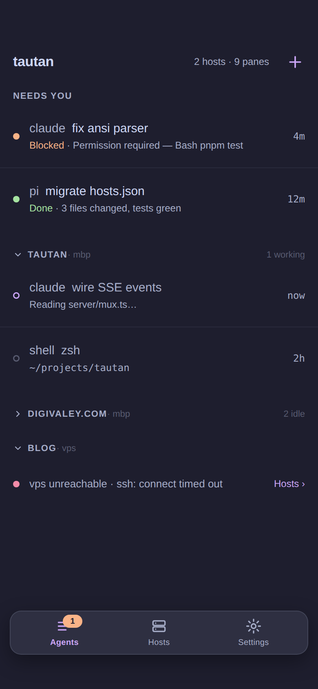
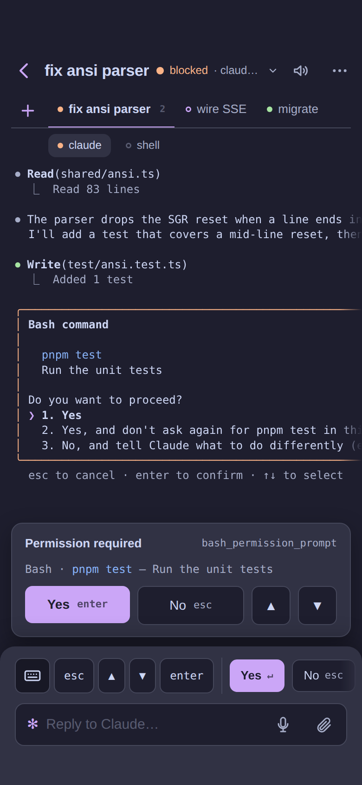
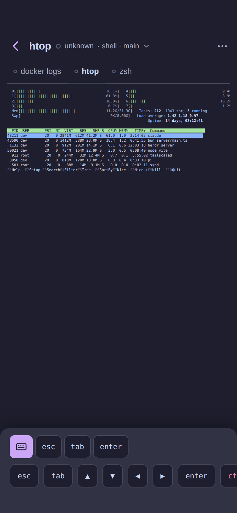
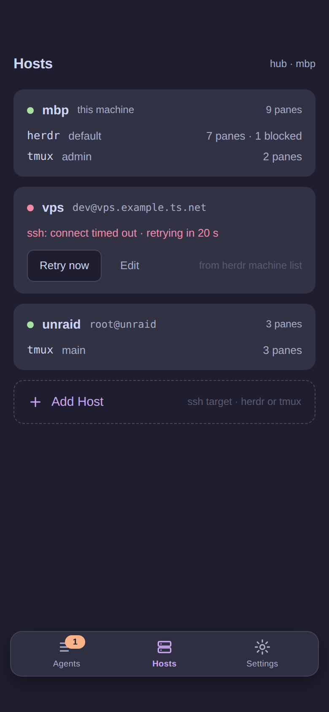
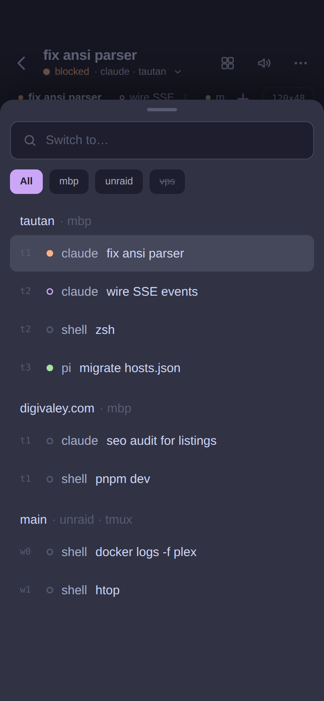
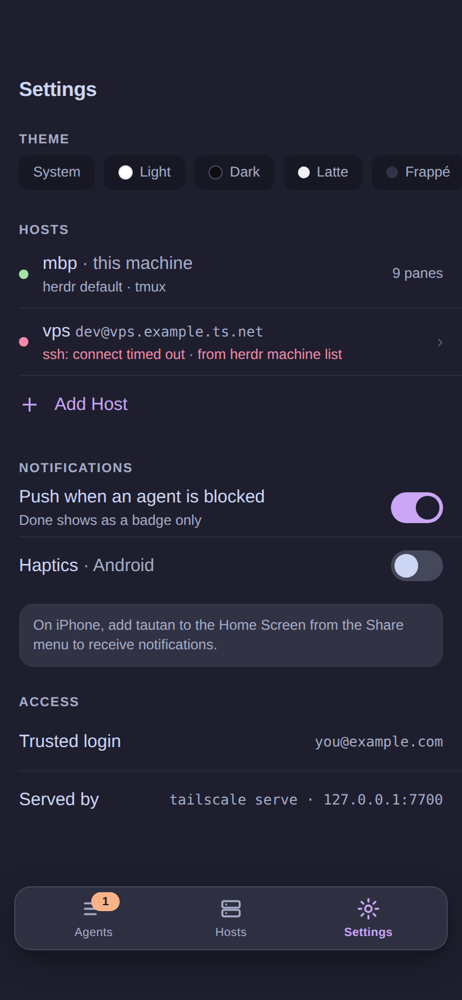
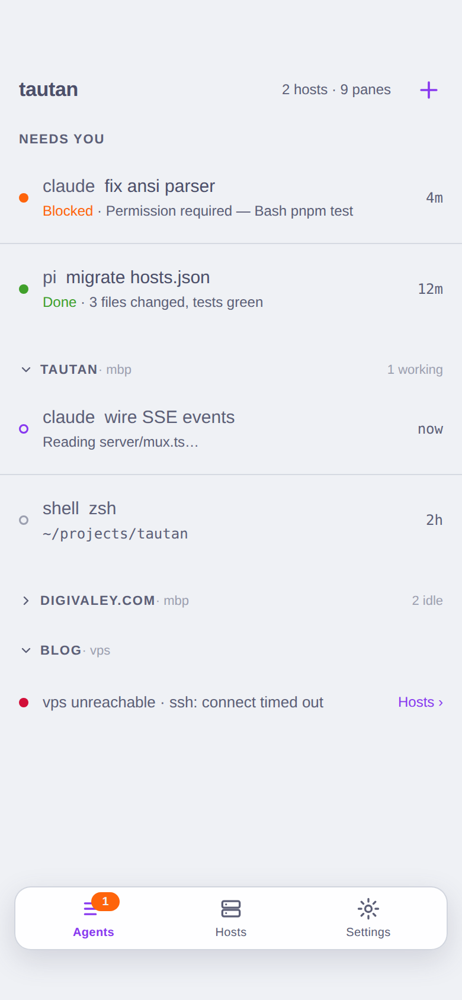
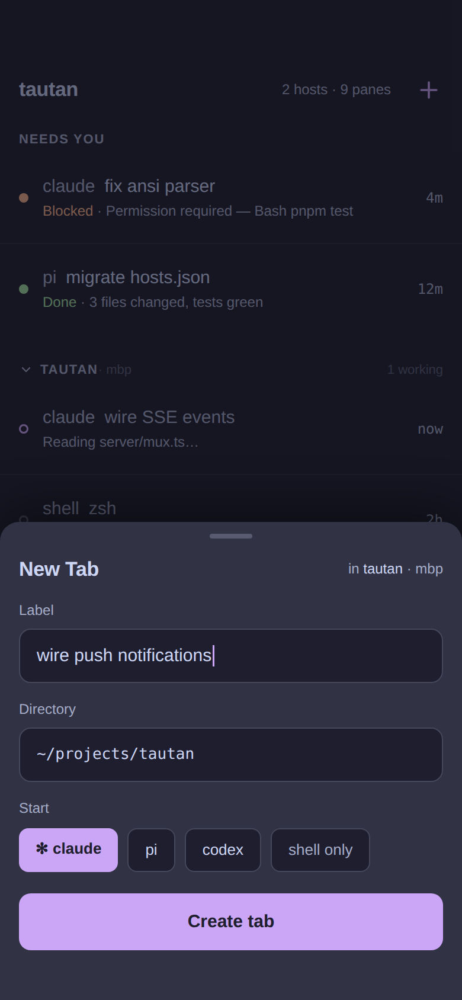

# Design direction

What taut should look like and why. The research behind each call is in [UX.md](./UX.md);
the settled product decisions are in [DECISIONS.md](./DECISIONS.md). The mockups are a
design canvas you can edit: **[taut Screens](https://claude.ai/code/artifact/ee67305a-ece1-4d62-b0b7-e866752a7030)**
(source under [design/src/](./design/src/), exports under [design/](./design/)).

## In one paragraph

Linear and Notion density on a phone: one accent, three surfaces, no boxed cards, 56 px
two-line rows, small-caps section labels. Status is a dot; filled means unseen, a hollow ring
means seen. The urgent list ("Needs you") is pinned above the Workspace groups. A Pane is a
full-screen push with the multiplexer's own rendered grid, a sticky blocked card built from
herdr's detection, a key bar ordered by real use, and a composer labelled with the agent's
glyph. A floating tab bar carries the three root destinations and hides while you type.

## Screens

| Screen | Mockup | What it shows |
|---|---|---|
| Agents · Mocha |  | Needs-you section, collapsible Workspace groups with Host suffix and a summary when collapsed, offline Host row, floating tab bar with badge |
| Pane · Claude blocked |  | Top bar: back, title, status line (tap opens Switch), actions Switch · read aloud · more (Wrap, Rename, Close). Tab strip under it: one underlined tab per Tab of the Workspace, status dot, Pane count when >1, + for a new Tab, Fit chip at the right. Grid with right-edge fade. Blocked card floating above the dock. Bottom dock: key bar and composer as the agent's prompt |
| Pane · shell |  | htop with Fit on, same top bar and Tab strip, shell key bar in the dock, no composer |
| Hosts |  | One card per Host: state, Muxes with Pane counts, error with Retry, Add Host |
| Switch drawer |  | From any Pane: search, Host chips, every Workspace with its Panes under their Tab labels. Two taps to any Pane on any Host |
| Settings |  | Theme chips, Hosts summary, push and haptics toggles, iOS install hint, access rows |
| Agents · Latte |  | Same structure in the light Catppuccin theme, with the corrected muted color |
| New Tab drawer |  | Drawer (vaul) with label, directory, agent chips, one primary action |

## Pane top bar and bottom dock

The Pane screen is two bars and a grid between them.

| Bar | Contents | Behaviour |
|---|---|---|
| Top bar | 44 px back chevron · title · status line "● status · agent · workspace ⌄" · actions: Switch (grid icon), read aloud (speaker), more (⋯) | Status line tap opens the Switch drawer. More holds Wrap, Rename, Close Pane, Resize to phone (v2) |
| Tab strip | Directly under the top bar, browser-tab position: one tab per Tab of the Workspace with status dot, label, Pane count when the Tab holds several; active tab underlined in accent; + creates a Tab; Fit chip (label = grid size) at the right end | Tap switches Tab; swipe on the strip too. When the active Tab holds several Panes a row of small Pane pills appears under the strip |
| Blocked card | floats above the dock, `--elevated`, 1 px hairline | Only while Status is `blocked` |
| Bottom dock | `--elevated`, 16 px top radius. Key bar, then the composer on agent Panes | Keyboard pushes the dock up; kept to two rows so the grid keeps its height while typing |

## Creating things

| Action | Where | Result |
|---|---|---|
| New Workspace | + in the Agents header → New Workspace drawer (directory, label, worktree branch) | herdr `workspace.create` / `worktree.create` |
| New Tab | + at the end of the Tab strip under the Pane's top bar, or long-press a Workspace header → New Tab drawer (label, directory, start agent) | herdr `tab.create` makes the Tab with one root Pane; the drawer optionally starts an agent in it |
| Rename, Close | ⋯ in the Pane top bar; long-press a row on the Agents screen | Drawer / Dialog |

A Tab is never its own screen: on the phone it is an entry in the Pane's Tab strip and a label
in the Switch drawer. A Tab with one Pane opens straight to that Pane.

## Switching at every level

| Between | Where | How |
|---|---|---|
| Hosts | Agents tab: Host chips under the header filter the list. Hosts tab: cards | tap |
| Workspaces | Agents tab: collapsible groups, state remembered. From a Pane: tap the subtitle to open the Switch drawer | tap |
| Tabs | The Tab strip under the Pane's top bar; the Switch drawer shows the same grouping | tap tab, swipe |
| Agents and shells | Tabs in the strip; Pane pills under the strip when a Tab holds several; swipe on the strip or the dock (never on the grid) | tap, swipe |

## Terminal width on a phone

The grid is what the multiplexer rendered at the server's size. Three answers, in order:

1. **Wrap** (v1): the same grid text reflowed to the phone width, client-side. Reading mode for agent output. Replaces the earlier Screen/Recent idea: Claude Code runs on the alternate screen, so herdr's "recent" returns the same rows as the visible grid.
2. **Fit** (v1): scale the grid to the phone width with exact metrics; the toggle label shows the grid size.
3. **Resize to phone** (v2, explicit): ask the Mux to resize the Pane to the phone's columns and rows (herdr `pane.resize`, tmux `resize-window`). Real reflow, but it changes the desktop's view of that Pane, so it is a button, never automatic, and it restores on leaving.

## Rules the mockups follow

| Rule | Value |
|---|---|
| Row | 56 px two-line; 44 px one-line; 12 px vertical, 16 px horizontal padding |
| Line 1 | agent name in `--muted`, title in `--fg`; unseen rows `font-weight: 500` |
| Line 2 | blocked reason → last non-empty screen line → `basename(cwd)`; status word printed for `blocked` and `done` |
| Right column | time since the last Status change, 12 px, tabular numerals |
| Dot | 8 px; filled = unseen, 1.5 px ring = seen; `--warn` blocked, `--ok` done, `--accent` working, `--muted` idle, `--danger` offline |
| Section label | 11 px, 600, +0.08 em, uppercase, `--muted`; 24 px above, 4 px below |
| Tab bar | Agents · Hosts · Settings; 52 px + safe area, inset 12 px, 14 px radius, `--elevated` at 88 %, blur, hairline; badge = unseen blocked count |
| Surfaces | `--bg` page · `--surface` inset controls (composer, key caps, chips) · `--elevated` raised (tab bar, blocked card, drawers) |
| Accent | primary button, current chip or tab, `working`, focus ring. Nothing else |
| Radius | 8 px chips, buttons and key caps; 10 px composer; 12 px cards and the blocked card; 14 px tab bar; 16 px drawer top. Dots stay circles. No pills |
| Type | caption 12/1.35 · body 15/1.45 · title 17/1.25 600 · mono 12/1.35 |
| Grid | scrolled by default, right-edge fade while it overflows; Fit chip scales the `<pre>`; Wrap (in ⋯) reflows |
| Key bar | agent: `esc ↑ ↓ tab shift+tab enter ctrl+c` · shell: `esc tab ↑ ↓ ← → enter ctrl+c ctrl+d` |
| Composer | 12 px label with the agent's glyph, placeholder in the agent's voice, mic replaces send while empty |
| Blocked card | sticky above the key bar, `--elevated`, title + rule id, one-line detection excerpt, Yes/No preset then hint keys |
| Chrome left blank | status bar area (54 px) and the keyboard; the OS draws both |

## Per-theme surface values

| Theme | `--bg` | `--surface` | `--elevated` | `--muted` |
|---|---|---|---|---|
| light | `#ffffff` | `#f4f4f5` | `#ffffff` + shadow | `#71717a` |
| dark | `#0e0e11` | `#17171b` | `#1c1c21` | `#8b8b96` |
| latte | `#eff1f5` | `#e6e9ef` | `#ffffff` | `#5c5f77` (was `#6c6f85`, failed 4.5:1) |
| frappé | `#303446` | `#292c3c` | `#414559` | `#a5adce` |
| macchiato | `#24273a` | `#1e2030` | `#363a4f` | `#a5adcb` |
| mocha | `#1e1e2e` | `#181825` | `#313244` | `#a6adc8` |

## Open questions

1. Call a Workspace a "Space" in the UI? (herdr says workspace; tmux says session; the maintainer says space.)
2. Blocked card: open by default, or collapsed to one line until tapped?
3. Theme picker: chips (as mocked) or a full list with previews?
4. Fit toggle label: the grid size (`120×48`) or the word "Fit"?

## How to update the mockups

Edit the files under `docs/design/src/`, then ask Claude to re-save the canvas, or edit the
canvas directly in the browser and press Save. Re-export the PNGs into `docs/design/` after
either.
