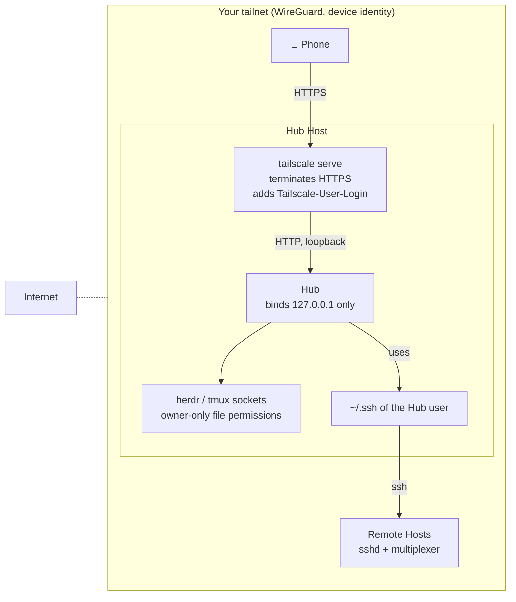

# Security model

taut lets a phone type into terminals where coding agents run with your permissions. Read
this before you expose a Hub to anything.

## Trust boundaries

| Boundary | What enforces it |
|---|---|
| Internet → tailnet | Tailscale. The Hub is never reachable from the internet. |
| Tailnet → Hub | `tailscale serve` (HTTPS, identity header). The Hub itself listens on loopback only. |
| Phone → Hub writes | `Origin` must match `Host` on every non-GET request (blocks DNS rebinding and cross-site posts). Optional trusted login: `Tailscale-User-Login` must equal the configured user. |
| Hub → multiplexers | Unix socket file permissions. herdr has no authentication of its own. |
| Hub → remote Hosts | Your SSH configuration. taut generates no keys and stores no credentials. |

## What an attacker can do

- **Anyone on your tailnet** who can reach the Hub can read every screen and send input to
  every agent, unless you set a trusted login. On a shared tailnet, set it, and restrict
  the Hub Host with Tailscale ACLs.
- **Anyone with the Hub user's shell** already has everything the Hub has. taut adds no
  new capability there.
- **A compromised phone** can do what you can do from it. There is no second factor in v1.

## What taut never does

- Listen on a non-loopback interface by default (`TAUT_BIND` changes this; do not).
- Store passwords, SSH keys, or tokens. `state.json` holds Seen markers, push subscriptions,
  VAPID keys for Web Push, and the optional trusted login.
- Render terminal output through `innerHTML`. Screens are text spans.
- Move focus or write state into a multiplexer beyond the input you send.

## Hardening checklist

1. Run the Hub on the machine you already trust with SSH access to the others.
2. Set the trusted login in Settings if more than one person is on the tailnet.
3. Use Tailscale ACLs so only your phone can reach the Hub Host's port.
4. Keep `tailscale serve` as the only way in; never expose 7700 directly.

## Reporting a vulnerability

Open a private security advisory on GitHub, or email the maintainer listed in `package.json`.
Give a description and reproduction steps; no proof-of-concept against other people's Hubs.
