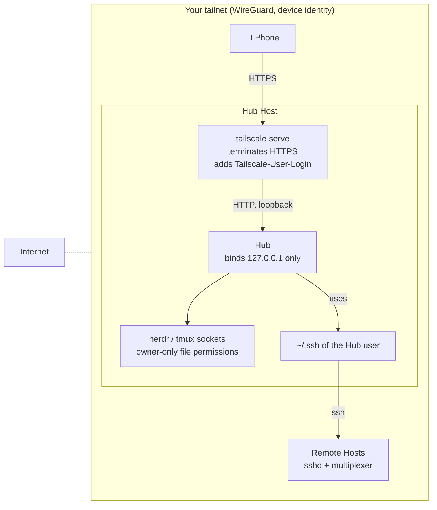

# Security model

tautan lets a phone type into terminals where coding agents run with your permissions. Read
this before you expose a Hub to anything.

## Trust boundaries

| Boundary | What enforces it |
|---|---|
| Internet → tailnet | Tailscale. The Hub is never reachable from the internet. |
| Tailnet → Hub | `tailscale serve` (HTTPS, identity header). The Hub itself listens on loopback only. |
| Phone → Hub writes | `Origin` must match `Host` on every non-GET request (blocks DNS rebinding and cross-site posts). Optional trusted login: `Tailscale-User-Login` must equal the configured user. |
| Hub → multiplexers | Unix socket file permissions. herdr has no authentication of its own. |
| Hub → remote Hosts | Your SSH configuration. tautan generates no keys and stores no credentials. |

## What an attacker can do

- **Anyone on your tailnet** who can reach the Hub can read every screen and send input to
  every agent, unless you set a trusted login. On a shared tailnet, set it, and restrict
  the Hub Host with Tailscale ACLs.
- **Anyone with the Hub user's shell** already has everything the Hub has. tautan adds no
  new capability there.
- **A compromised phone** can do what you can do from it. There is no second factor in v1.

## What tautan never does

- Listen on a non-loopback interface by default (`TAUTAN_BIND` changes this; do not).
- Store passwords, SSH keys, or tokens. `state.json` holds Seen markers, push subscriptions,
  the VAPID key pair for Web Push, and the optional trusted login.
- Render terminal output through `innerHTML`. Screens are text spans.
- Move focus or write state into a multiplexer beyond the input you send.

## Push notifications

Two things leave the Hub when push is on.

- **`state.json` becomes a credential.** It holds the VAPID **private** key and one push
  endpoint per device. Anyone who reads the file can send notifications to your phone in
  the Hub's name. The file lives under `$XDG_STATE_HOME/tautan` (`~/.local/state/tautan`), is
  written by the Hub user, and belongs in no backup you share. Delete it to revoke every
  subscription: the Hub makes a new key pair on the next start, and each phone re-subscribes
  the next time you open the app.
- **A notification says what the agent wants.** The payload carries the agent name, the
  Workspace label and one line of the Pane's output. It travels encrypted end to end
  (RFC 8291), so Apple and Google relay it without reading it — but the phone shows it in
  the notification tray, over the lock screen, on the watch. Treat the tray as public and
  turn push off if that one line can be sensitive.

The Hub never pushes for `done`, only for a Pane that enters `blocked`, so the tray sees
one line per question, not a stream.

## Smart replies

Smart replies are **off** by default, on the Hub (`TAUTAN_SUGGEST` unset) and on the phone
(`tautan.smart`). They stay off until you turn them on in Settings.

- **Screen text leaves the machine.** With the switch on, every time an agent Pane enters
  `blocked` or `done` the Hub sends the last 40 lines of that Pane's Screen to the configured
  provider (z.ai or Anthropic) and gets three one-line replies back. Those lines are
  whatever the agent printed: file paths, diffs, command output, anything on the terminal.
  A shell Pane is never sent, and no other Pane is.
- **The key never leaves the Hub.** `TAUTAN_SUGGEST_KEY` (or `ZAI_API_KEY`,
  `~/.config/zai/api-key`, `ANTHROPIC_API_KEY`) is read by the Hub, used for the one call,
  and never sent to the phone. `GET /api/settings` reports the provider and model names
  only.
- **The provider is a third party.** Their retention and training terms apply to that text.
  Leave Smart replies off on any Host whose screens you would not paste into a chat window.

Turning the switch off in Settings stops the calls: it writes the Hub flag through
`POST /api/settings/suggest` as well as the phone's own, and nothing is drafted for a
Pane again until it goes back on.

## Attachments

A file picked in the composer is written to the Pane's Host under
`$XDG_CACHE_HOME/tautan/attachments/` (`~/.cache/tautan/attachments`), with the Hub user's
permissions. The agent in that Pane already runs as that user, so the file gives it
nothing new.

- **The name is not trusted.** It arrives in `X-Name`. The Hub keeps only the part after
  the last `/` or `\`, turns every character outside `[A-Za-z0-9._-]` into `_`, and cuts
  it to 120 characters. No path segment survives, so the name cannot leave the directory.
  A `<unix-ms>-` prefix keeps two photos with the same name apart.
- **The size is capped.** `TAUTAN_MAX_ATTACHMENT_MB` (200) is checked against
  `Content-Length`, then again while the body streams. A body that passes the cap gets a
  413, and the Hub deletes the partial file.
- **The write is Origin-guarded**, like every non-GET request, so another site cannot put
  a file on your Host.
- **Nothing comes back.** The Hub never serves an attachment, lists the directory, or
  deletes a finished file. Clean the directory yourself when you want the space back.

## Interactive screen

An Affordance and a mouse report both end as bytes in the Pane's pty, through the same
`pane.send_input` that the composer uses. `raw` on `POST /api/panes/:key/input` is the one
field that is not escaped on the way: whatever the client sends reaches the program as it
stands, escape sequences included. That is the point — an SGR mouse report is an escape
sequence — and it is also why only the Hub builds those bytes.

- **Mouse bytes are typed text to a program that never asked for them.** A program with no
  mouse mode on prints `\x1b[<0;5;9M` as keystrokes, which is how an earlier X10 report
  opened htop's sort menu. So the Hub answers 409 `{error: 'mouse-off'}` unless the request
  asserts `allow`, and the client only asserts it from the App profile or the per-Pane
  switch. An unknown program is off by default, and the contract test proves a plain shell
  receives nothing.
- **The Hub validates before it sends.** The kind must be one of the five, and each
  coordinate must be an integer in 1…9999, so a report cannot carry an arbitrary payload
  into the `raw` path.
- **Both are Origin-guarded**, like every other write, and both need the trusted login when
  one is set. Nothing new is exposed: a phone that can type into a Pane can already do
  everything the keys do.

## Diff review

`GET /api/workspaces/:key/diff` runs `git diff` in that Workspace's cwd. The
command runs with the Hub user's permissions: directly on the Hub's machine, or
over the Host's non-interactive SSH connection for a remote Workspace. The agent
in that Workspace already runs as the same user, so the diff shows nothing the
agent could not print into its own Pane.

- **The Hub never writes.** Only `diff`, `config`, `rev-parse` and
  `symbolic-ref` run. tautan never stages, commits, checks out or resets.
- **The scope is a fixed list.** `working`, `staged` and `base` are the only
  accepted values; anything else is a 400. A `file=` value is passed after
  `--`, so a path cannot become a git option.
- **The cwd comes from the Mux, never from the request.** The key selects a
  Workspace the Hub already knows; the request cannot name a directory.
- **Diff content is served only to the Hub's clients**, over the same boundary
  as a Screen: loopback bind, Tailscale in front, the Origin check on writes,
  and the trusted login when it is set. A diff is source code, so treat it like
  the terminal output beside it.

## Remote Hosts and trusted login

When `trustedUser` is configured, the Hub requires every request—including static files and
event streams—to carry the same `Tailscale-User-Login` value. Setting a non-empty value is
accepted only when that very request already carries the proposed value, preventing an
accidental lock-out. Clearing it with `null` disables the check; when it is unset the header
never blocks access.

The Hub relies on the operating-system user's SSH keys, agent, and SSH configuration. All
discovery and transfer connections use `BatchMode=yes`, so tautan never opens a password
prompt. Host probing runs SSH against a user-provided target, but the target is validated as
a single non-empty argv element with no whitespace and no leading dash.

Attachments sent to a remote Host are streamed over SSH and stored below
`~/.cache/tautan/attachments`. Failed, empty, aborted, and over-limit transfers trigger a remote
cleanup attempt.

## Hardening checklist

1. Run the Hub on the machine you already trust with SSH access to the others.
2. Set the trusted login in Settings if more than one person is on the tailnet.
3. Use Tailscale ACLs so only your phone can reach the Hub Host's port.
4. Keep `tailscale serve` as the only way in; never expose 7700 directly.

## Reporting a vulnerability

Open a private security advisory on GitHub, or email the maintainer listed in `package.json`.
Give a description and reproduction steps; no proof-of-concept against other people's Hubs.
